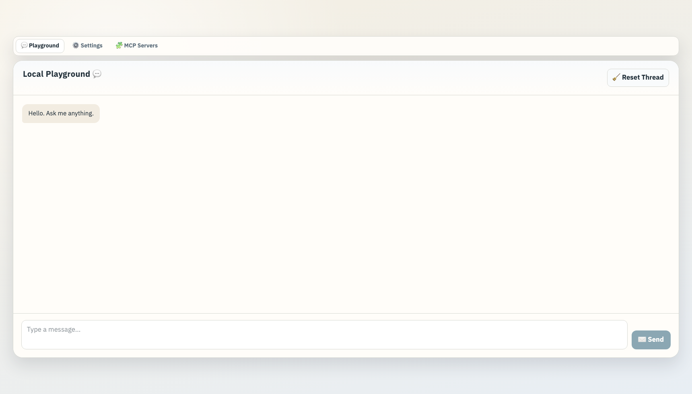

# Local Playground

`Local Playground` is a desktop-first local playground app built with Azure OpenAI and the Agents SDK.  
It is designed as a practical testing workbench, not just a basic chat UI, so you can validate Azure connectivity, agent behavior, and MCP integrations in one place.

## What This Application Is

This application is a development and validation workbench for:

- Azure OpenAI connectivity using `DefaultAzureCredential`
- Dynamic discovery of Azure projects and deployments
- Conversation execution through the Agents SDK
- Runtime tuning (`reasoning effort`, `context window`)
- Agent Instruction editing and file-based loading
- MCP server integration (`streamable_http`, `sse`, `stdio`) with reusable profiles

## Screenshot



_Desktop UI: switch between Playground, Settings, and MCP Servers tabs to manage connection settings and conversations._

## Screen Layout

### 1. Playground

- View conversation history, type, and send messages
- Markdown rendering for assistant responses
- JSON syntax highlighting when responses are JSON
- Thread reset

### 2. Settings

- Azure Connection (project / deployment selection)
- Azure Login / Logout actions
- Agent Instruction editing + file loading (`.md/.txt/.xml/.json`, up to 1MB)
- Reasoning Effort / Context Window controls (temperature is always omitted)

### 3. MCP Servers

- Add MCP servers
- Re-add servers from Saved Configs
- Review and remove Added Servers
- Persistent config path: `~/.foundry_local_playground/mcp-servers.json`
- Last-used Azure project/deployment per tenant: `~/.foundry_local_playground/azure-selection.json`

## Core Specifications

- App name: `Local Playground`
- npm package name: `local-playground`
- Azure auth: `DefaultAzureCredential`
- Azure endpoint format: v1 (`.../openai/v1/`)
- Runtime stack: React Router + TypeScript
- Agent runtime: `@openai/agents` + `@openai/agents-openai`

## Connection Flow

1. Authenticate to Azure using `DefaultAzureCredential`
2. Discover accessible Azure OpenAI projects from ARM
3. Reload deployments for the selected project
4. Execute conversation with Agents SDK using the selected deployment
5. Optionally connect MCP servers to extend tool capabilities

## Login-State Behavior

- Playground is locked while logged out
- Run Azure Login in Settings to unlock usage
- Right after sign-in, the Playground tab is visually highlighted for easier navigation

## Setup

### 1. Install Dependencies

```bash
npm install
```

### 2. Sign in to Azure

```bash
az login
```

### 3. Start the Development Server

```bash
npm run dev
```

The app is typically available at `http://localhost:5173`.

## Scripts

- `npm run dev`: start dev server
- `npm run build`: build for production
- `npm run start`: start production server
- `npm run typecheck`: run TypeScript checks

## API Endpoints

- `POST /api/chat`
- `GET /api/azure-connections`
- `POST /api/azure-login`
- `POST /api/azure-logout`
- `GET/POST /api/mcp-servers`
