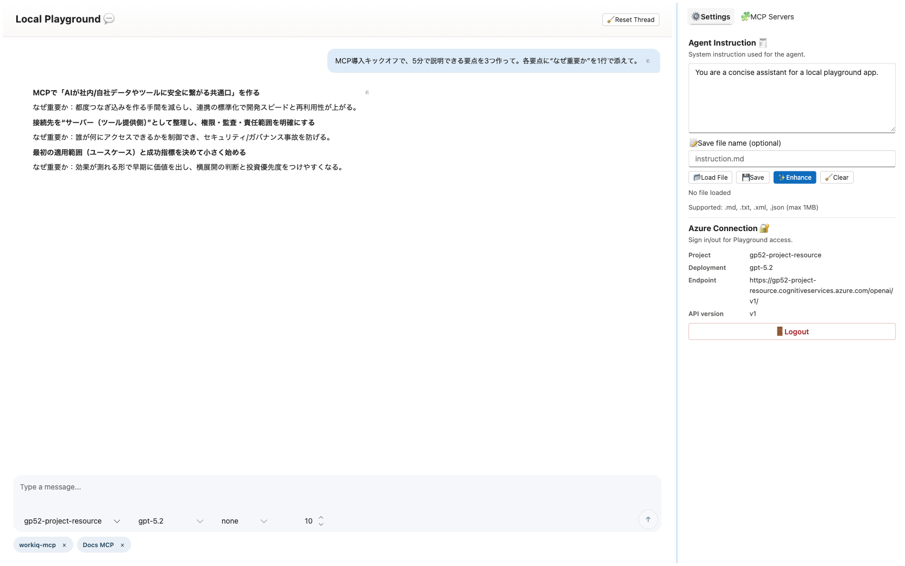
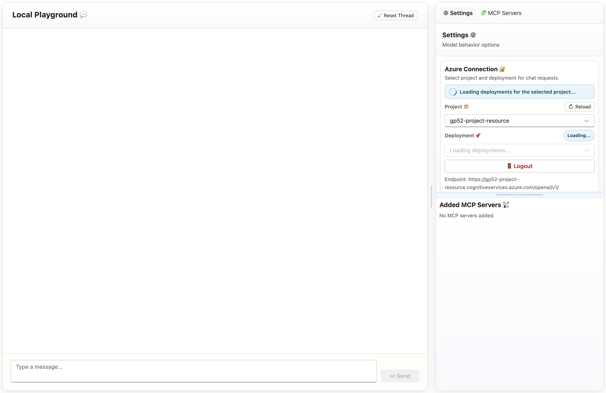
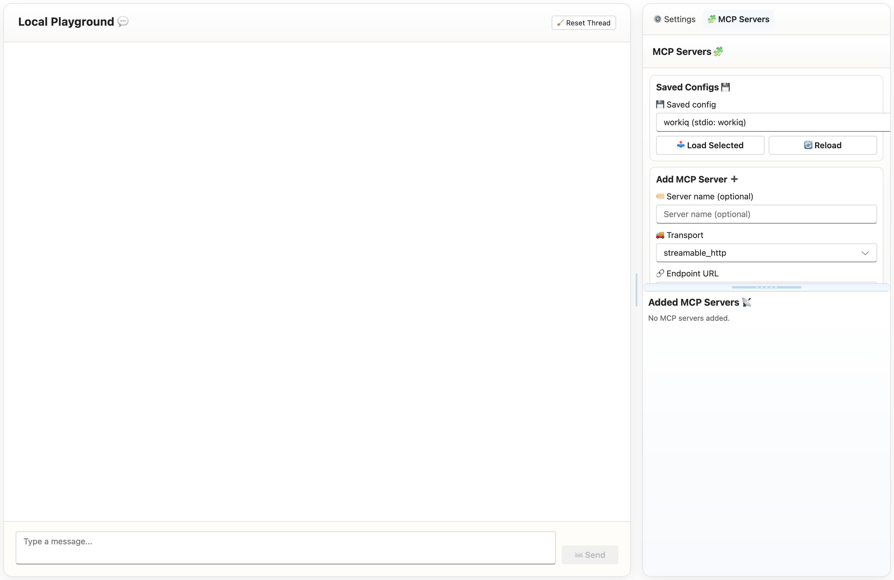

# Local Playground

`Local Playground` is a desktop-first app for testing Azure OpenAI agents and MCP servers locally.

## At A Glance

- Chat playground powered by Agents SDK
- Azure project/deployment selection with `DefaultAzureCredential`
- MCP server testing (`streamable_http`, `sse`, `stdio`)
- Inline MCP operation logs (JSON-RPC request/response)

## Screenshots

### Playground



### Settings



### MCP Servers



## Quick Start (Copy & Paste)

```bash
git clone https://github.com/anaregdesign/local-playground.git
cd local-playground
npm install
az login
npm run dev
```

Open `http://localhost:5173`.

## Main Features

- Two-pane desktop layout with draggable splitters
- Markdown rendering and JSON syntax highlighting in chat
- Agent Instruction load/save/enhance workflow
- Per-server MCP headers, Azure auth scope, and timeout settings

## Developer Details

### Desktop Shell (Electron)

```bash
# development shell
npm run desktop:dev

# production-like local shell
npm run desktop:start

# build installers
npm run desktop:package
```

Per-OS packaging:

- `npm run desktop:package:mac`
- `npm run desktop:package:win`

### Release Artifacts

Pushing a `v*.*.*` tag triggers GitHub Actions to publish installers to GitHub Releases:

- macOS: `.dmg`, `.zip`
- Windows: `.exe` (NSIS)

### Persistence Paths

Configuration directory:

- macOS/Linux: `~/.foundry_local_playground/`
- Windows: `%APPDATA%\FoundryLocalPlayground\`

Files:

- Azure selection: `azure-selection.json`
- MCP profiles: `mcp-servers.json`
- Saved prompts: `prompts/`

Legacy Windows fallback is also read:

- `%USERPROFILE%\.foundry_local_playground\`

### Common Scripts

- `npm run dev`
- `npm run build`
- `npm run start`
- `npm run typecheck`
- `npm run test`
